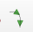
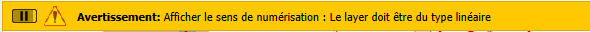
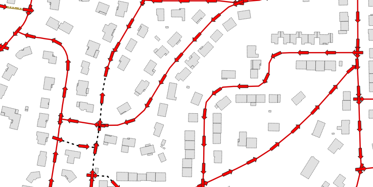
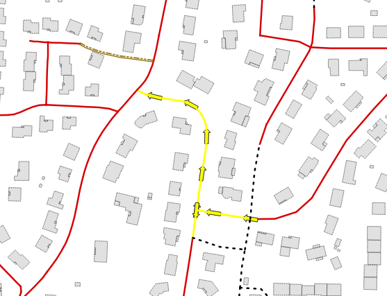

<table>
<colgroup>
<col style="width: 21%" />
<col style="width: 78%" />
</colgroup>
<tbody>
<tr>
<td rowspan="2"></td>
<td style="text-align: center;">
<strong>Manuel utilisateur du plugin
«sens de numérisation» </strong>

<strong>v0.4.2</strong>
</td>
</tr>
<tr>
<td style="font-size: 16px;text-align: center;">Développeur  : Gérôme PECHEUR (IGN)</td>
</tr>
</tbody>
</table>

## Sommaire

- [1. Prérequis](#prerequis)

- [2. Présentation](#presentation)

- [3. Utilisation](#utilisation)

  <h2 id="prerequis" style="color: white;margin:0;" >1. Prérequis</h2>

- Version de QGIS : 3.28 ou supérieur

- Le plugin « maitre » doit préalablement être installé : 
[maitre-qgis-plugin sur GitHub](https://github.com/IGNF/maitre-qgis-plugin)

  <h2 id="presentation" style="color: white;margin:0;" >2. Présentation</h2>

Ce plugin affiche sur le layer actif, le sens de numérisation sous la
forme d’une petite flèche sur chaque entité

Seuls les layers de type linéaire sont prise en compte.

Il se « lance » via le menu IGN ou via le
bouton dans la barre d’outils
(suivant la configuration du plugin maitre)

  <h2 id="utilisation" style="color: white;margin:0;" >3. Utilisation</h2>

Si on essaye d’afficher le sens de numérisation sur un layer qui n’est
pas de type linéaire, un warning s’affiche dans QGIS

On active/désactive l’affichage par appuis successif sur le bouton

2 cas possibles :

1 : Le layer actif n’a aucune sélection, dans ce cas toutes les entités
affichent une petite flèche.

2 : Des entités sont sélectionnées, dans ce cas, seuls ces entités
affichent une petite flèche

